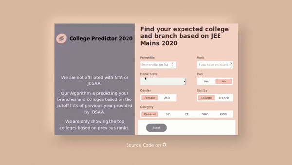

# JEE Mains 2020 College Predictor
*The website* : [https://collegepredictor.ml/](https://collegepredictor.ml/) 

This predictor uses the dataset provided by [JoSAA](https://josaa.nic.in/WebInfo/Page/Page?PageId=1&LangId=P) to predict the colleges an engineering aspirant may get. If no rank is provided, the app predicts the rank using Linear Regression.



## Technology Stack
- Python
- HTML
- CSS
- Bootstrap
- Jinja
- Flask
- ML Libraries: numpy, pandas, sk-learn, matplotlib

## Dataset
[Joint Seat Allocation Authority (JoSAA) 2020](https://josaa.nic.in/webinfo/Page/Page?PageId=6&LangId=P)

## For Local Use:
- Clone this Github repository.
- Open a CLI and navigate to this repo on your local system.
- Run `pip3 install -r requirements.txt` to grab all the necessary packages.
- If you are using virtual environment for the first time then copy the following code:

```
virtualenv venv -p C:/Users/username/AppData/Local/Programs/Python/Python38/python.exe

.\venv\Scripts\activate

set FLASK_APP=run.py
set FLASK_ENV=development

flask run
```
Where `username` is the current user.

## Run Using Docker:
`docker-compose up --build`

## Todo
- [X] Mobile Optimization
- [ ] Having more features in dataset
- [ ] SEO Friendly 

## License
This project is licensed under [MIT License](LICENSE).

**Pull requests are more than welcome!** :octocat:
